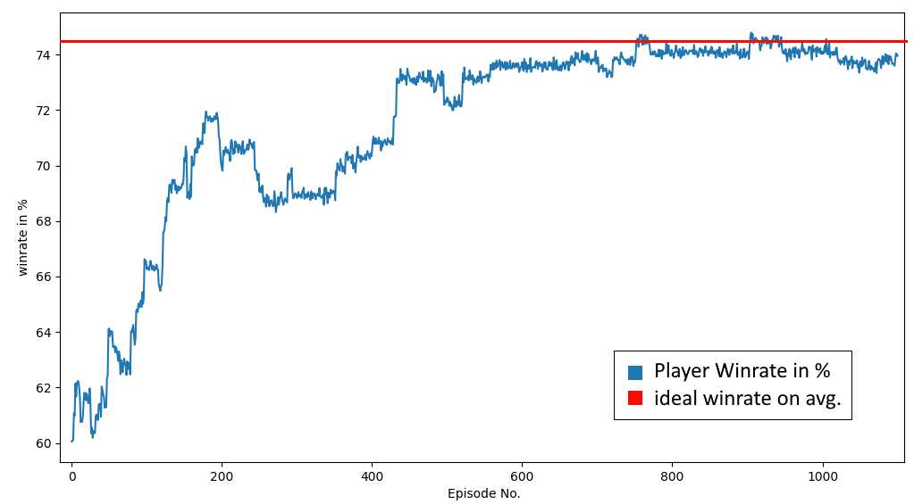
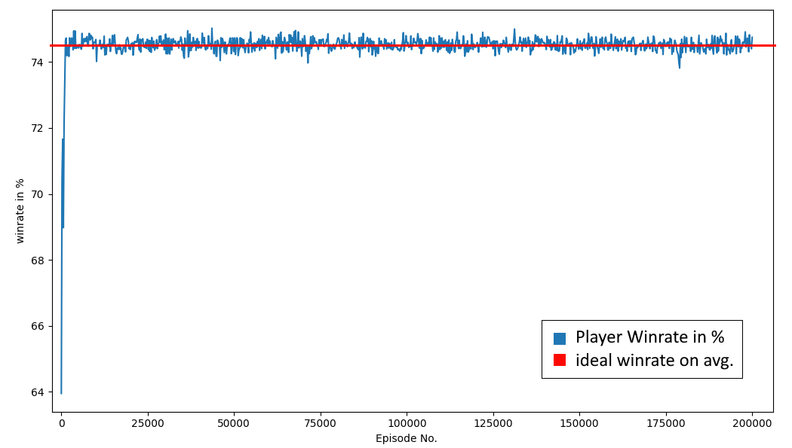

# reinforcement learning angewandt auf ein simples Würfelspiel
simpleRLdicegame ist ein sehr einfaches reinforcement learning Programm, das dazu dient zu zeigen, dass ein RL-Algorithmus erfolgreich auf die von mir erstellte Umgebung angewandt werden kann.

## Die Regeln des Spiels
Das Spiel funktioniert wie folgend: Es wird ein erster Würfel geworfen, der eine Nummer von 1-6 zeigt. Der Spieler wirft daraufhin einen zweiten Würfel und darf nach dem Vergleich der beiden Ergebnisse entscheiden, ob er seinen eigenen Würfel erneut werfen möchte. Das Ziel des Spielers ist es eine höhere Zahl als die erste zu erreichen. Bei einem Unentschieden gewinnt der Spieler.

Ein RL-Programm sollte in der Lage sein zu erkennen, dass es richtig ist nochmals zu würfel, wenn die erste Zahl größer ist und, dass es richtig ist nicht zu würfel, wenn der Spieler bereits eine ausreichende Zahl hat.

## Stochastische Ergebnisse bei Q-learning

In den meisten Umgebungen in denen Q-learning angewendet wird ist das Ergebnis einer Handlung garantiert. Da dieses Programm sich mit Würfel befasst stimmt das für diese Umgebung nicht, da die Entscheidung nochmals zu würfeln keinen eindeutigen Ausgang hat.

Bei Q-learning wird der Q-value geändert auf Basis der Q-values der besten zukünftigen Handlung. Da der aus einer Handlung resultierende Game-State nicht eindeutig vorhersagbar ist, ist auch der Q-value der besten zukünftigen Handlung nicht eindeutig erkennbar. 

Um dies zu korrigieren wird stattdessen der Durchschnitt aller möglichen Gamestates betrachtet. Dies wird durch die Funktion ‘get_avg_max_future_q’ gelöst. 

## Die Leistung des Spielers

Um zu testen wie gut der Algorithmus funktioniert betrachtet man die Siegesrate(winrate) über eine große Zahl an Spielen. Dies ist an verschieden Punkten im Trainingsprozess durchgeführt worden. Das ergebnis ist im folgenden Graph dargestellt:

Insgesamt erhöht sich die Siegesrate mit fortlaufendem Training. Das ist genau das, was ich mir erhofft hatte!

Es gibt erstaunlich fluktuation bei der Siegesrate sowohl zu Beginn des Training als auch um die 74,5%-Marke, die die durchschnittliche Siegesrate bei optimalem Verhalten darstellt. Dies könnte durch die zufällige Verteilung der Würfelergebnisse begründet sein. Aufgrund der Größe der Abweichungen könnte es sich aber auch um einen Fehler im Q-table handeln oder einen Bug im Code.

Ein weitere Bewertung ist durchgeführt worden mit einer deutlich höheren Anzahl an Episoden um den Verlauf eines deutlich länger dauernden Trainings zu betrachten.

Die Siegesrate bleibt bei 74,5%, fluktuiert jedoch nach wie vor. Da das Programm entworfen wurde um zu testen, ob RL mit zufälligen Ergebnissen umgehen kann sehe dieses Ergebnis trotzdem als Erfolg. Es sollte möglich sein diese Technik auf ein komplexeres Würfelspiel anzuwenden.

#### Randnotiz:

In diesem Code ist es möglich die Anzahl der Würfe, die dem Spieler zur verfügung stehen, zu ändern. Dabei werde zusätzlich Q-table erstellt. Es wäre einfacher den Selben Q-table für jede Situation zu verwenden, da die richtige Entscheidung unabhängig von der Anzahl der verbleibenden Würfe ist. Dies würde auch die Trainingsgeschwindigkeit verbessern und Memory sparen.

Die zusätzlichen Q-table hier dienen als eine Art Machbarkeitsnachweis: In einem zukünftigen Projekt werde ich ein anderes Würfelspiel behandeln, dessen Regel deutlich komplexer sind und deswegen mehrere verschieden Q-table benötigen. Die zusätzlichen Q-table, die in diesem Programm erstellt werden, zeigen, dass dies möglich ist.
